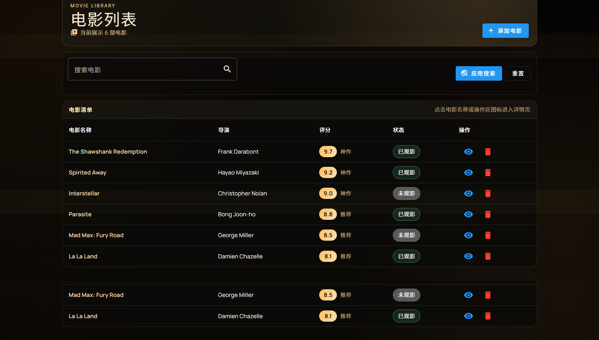

# CinemaFlow - 电影管理系统

## 项目简介

CinemaFlow 是一个基于 Angular 19 开发的个人电影管理系统，用于记录和管理观影清单。本项目是《商务网站开发与管理》课程的第三次上机课作业。

## 技术栈

- **框架**: Angular 19
- **语言**: TypeScript
- **样式**: CSS
- **路由**: Angular Router

---

## 路由配置说明

### 关键代码位置

路由配置文件位于：
```
cinema-flow/cinema-flow/src/app/app.routes.ts
```

### 路由配置代码

```typescript
import { Routes } from '@angular/router';

export const routes: Routes = [
  { path: '', redirectTo: '/home', pathMatch: 'full' },
  {
    path: 'home',
    loadComponent: () =>
      import('./pages/home/home.component').then((m) => m.HomeComponent),
    title: 'CinemaFlow - 电影主页'
  },
  {
    path: 'dashboard',
    loadComponent: () =>
      import('./pages/dashboard/dashboard.component').then(
        (m) => m.DashboardComponent
      ),
    title: 'CinemaFlow - 仪表盘'
  },
  {
    path: 'movies',
    loadComponent: () =>
      import('./pages/movie-list/movie-list.component').then(
        (m) => m.MovieListPageComponent
      ),
    title: 'CinemaFlow - 电影列表'
  },
  {
    path: 'movies/:id',
    loadComponent: () =>
      import('./pages/movie-detail/movie-detail.component').then(
        (m) => m.MovieDetailPageComponent
      ),
    title: 'CinemaFlow - 电影详情'
  },
  {
    path: 'add',
    loadComponent: () =>
      import('./pages/movie-add/movie-add.component').then(
        (m) => m.MovieAddPageComponent
      ),
    title: 'CinemaFlow - 添加电影'
  },
  {
    path: 'about',
    loadComponent: () =>
      import('./pages/about/about.component').then((m) => m.AboutPageComponent),
    title: 'CinemaFlow - 关于'
  },
  { path: '**', redirectTo: '/home' }
];
```

### 路由配置关键点

1. **懒加载组件**: 使用 `loadComponent` 和动态导入实现组件懒加载
2. **路径参数**: `/movies/:id` 支持动态参数传递
3. **通配符路由**: `**` 匹配所有未定义路径，重定向到首页
4. **页面标题**: 每个路由都配置了 `title` 属性

---

## 页面路由切换效果展示

### 1. 首页 (Home)
**路由**: `/home`


> **截图说明**: 年度电影风格榜页面，展示推荐电影和年代片单

**功能**: 
- 欢迎语和快速入口
- 统计数据概览
- 最近添加的电影列表

---

### 2. 仪表盘 (Dashboard)
**路由**: `/dashboard`


> **截图说明**: 仪表盘页面，展示实时统计卡片和最近添加的电影

**功能**:
- 实时统计卡片（总电影数、已观影、待观看、平均评分）
- 最近添加的电影快速浏览
- 快捷操作按钮

---

### 3. 电影列表 (Movie List)
**路由**: `/movies`



> **截图说明**: 电影列表页面，表格形式展示所有电影信息

**功能**:
- 电影表格展示
- 搜索功能
- 状态标签（已观影/未观影）
- 评分等级显示
- 操作按钮（查看详情/删除）

---

### 4. 添加电影 (Add Movie)
**路由**: `/add`


> **截图说明**: 添加新电影表单页面，包含基本信息录入和评分系统

**功能**:
- 表单输入（电影名称、导演、上映日期、海报 URL）
- 评分滑块
- 已观影状态切换
- 保存/取消操作

---

## 路由切换流程图


---

## 项目结构

```
cinema-flow/
├── screenshots/              # 截图目录
│   ├── home.png             # 首页截图
│   ├── dashboard.png        # 仪表盘截图
│   ├── movie-list.png       # 电影列表截图
│   └── add-movie.png        # 添加电影截图
├── README3.md               # 本文件
└── cinema-flow/
    └── src/
        └── app/
            ├── app.routes.ts          # 路由配置
            ├── app.component.ts       # 根组件
            ├── pages/                 # 页面组件
            │   ├── home/
            │   ├── dashboard/
            │   ├── movie-list/
            │   ├── movie-detail/
            │   ├── movie-add/
            │   └── about/
            ├── components/            # 可复用组件
            ├── services/              # 服务
            ├── models/                # 数据模型
            └── pipes/                 # 管道
```

---

## 开发环境启动

```bash
cd cinema-flow/cinema-flow
npm install
ng serve
```

访问 `http://localhost:4200` 查看应用。

---

## 作者信息

- **课程**: 商务网站开发与管理
- **学期**: 2026 春
- **作业**: 第三次上机课作业
- **提交日期**: 2026 年 3 月
